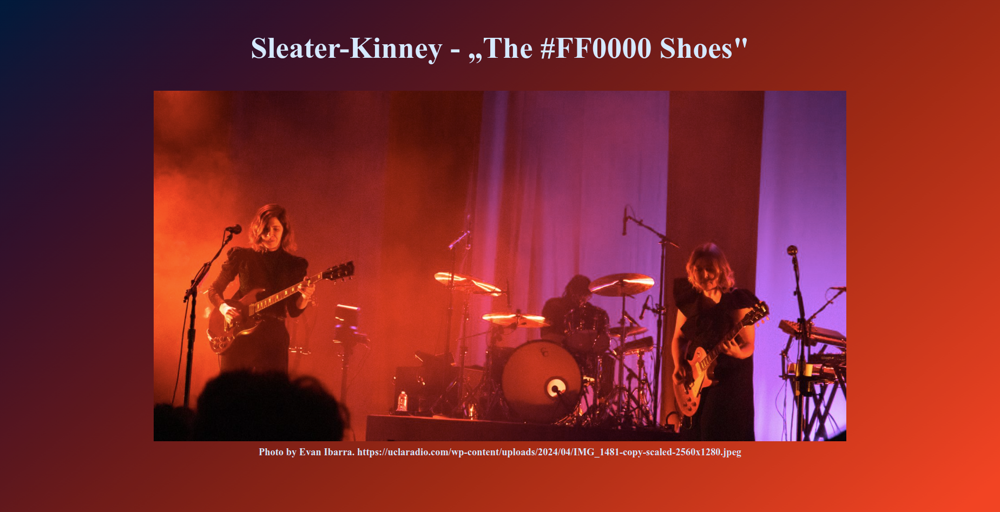
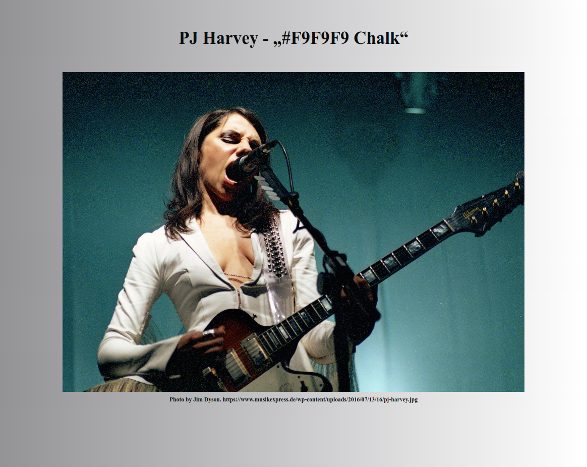
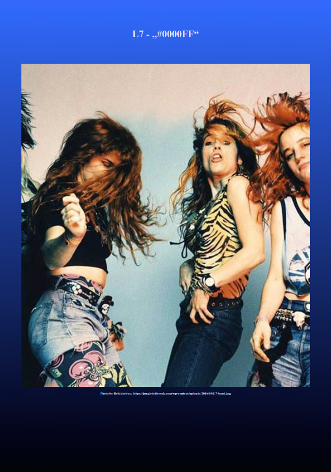
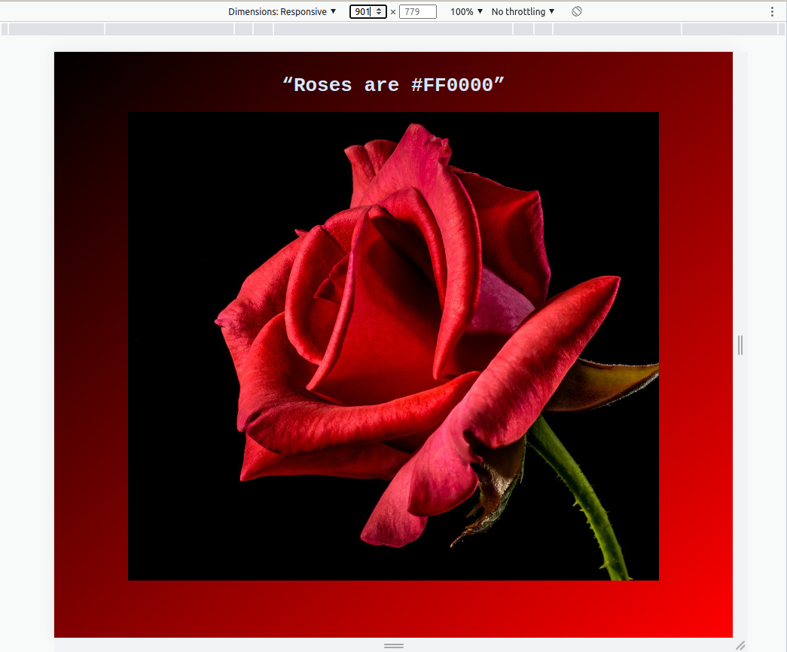
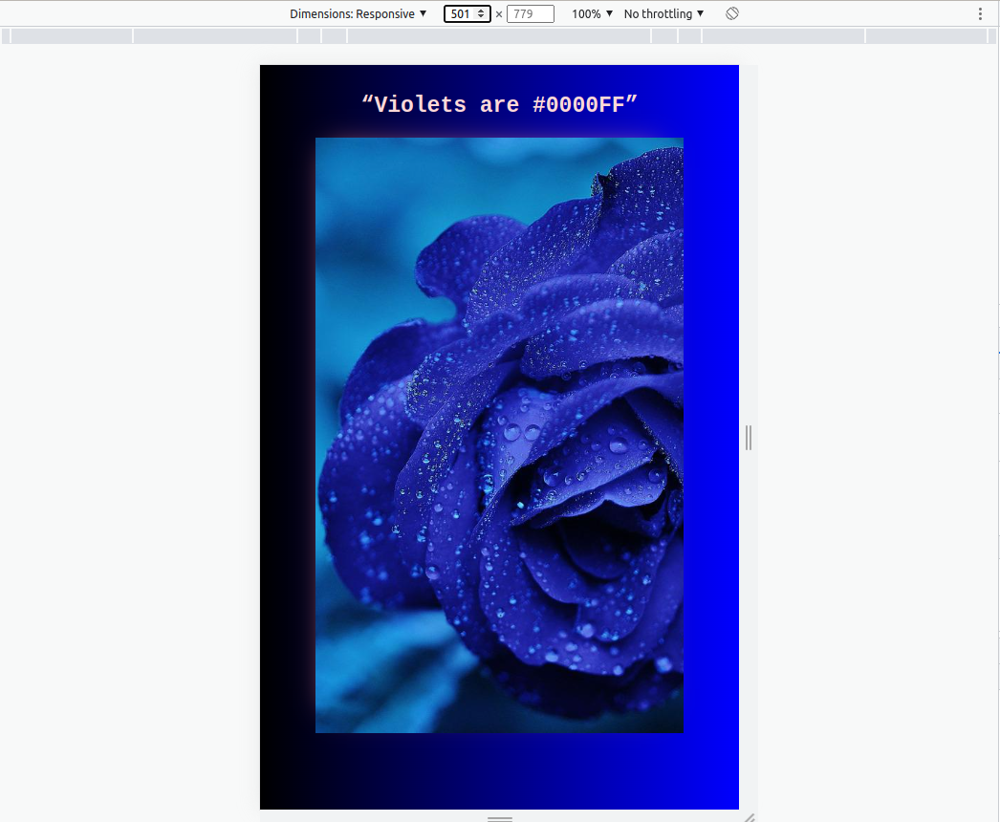
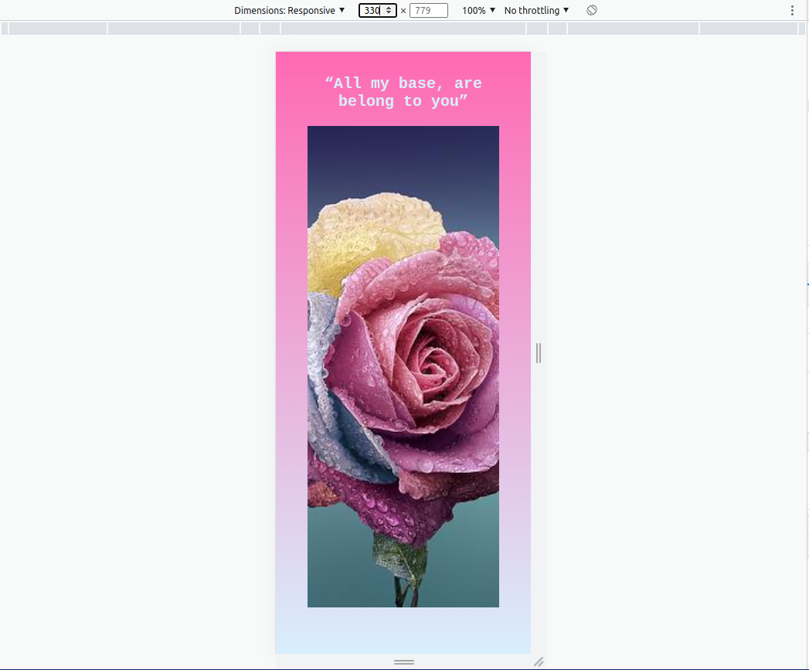

# About being different - colorful songs of feminist musicans - practicing responsive design

## Exercise Course-Module 1 - UserInterfaceBasics (UIB) - HTML/CSS

created at 10.10.22

Created a responsive design with CSS and responsive images with HTML like the `reference images`
Images created with `picture`, `source` & `img` HTML elements. Used CSS media queries to change images and the styles for the elements on different viewport sizes, linear-gradients similar to the color in the song title,

### my desktop version:

image-source: Sleater-Kinney. Photo by Evan Ibarra.
https://uclaradio.com/wp-content/uploads/2024/04/IMG_1481-copy-scaled-2560x1280.jpeg

 

### my tablet version:

image-source: P.J.Harvey-Foto: Getty Images. Jim Dyson. https://www.musikexpress.de/wp-content/uploads/2016/07/13/16/pj-harvey.jpg

 

### my mobile version:

image-source: L7. Photo by Rebjukebox: https://jungleindierock.com/wp-content/uploads/2016/09/L7-band.jpg

### Mockups

#### desktop:

#### tablet:

#### mobile:

